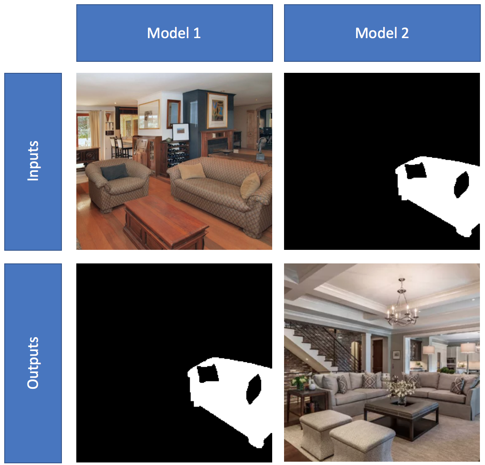
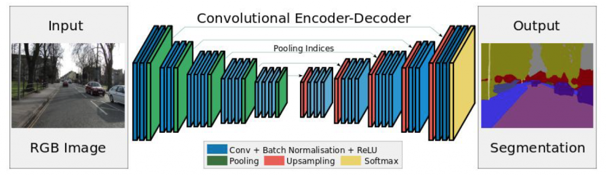
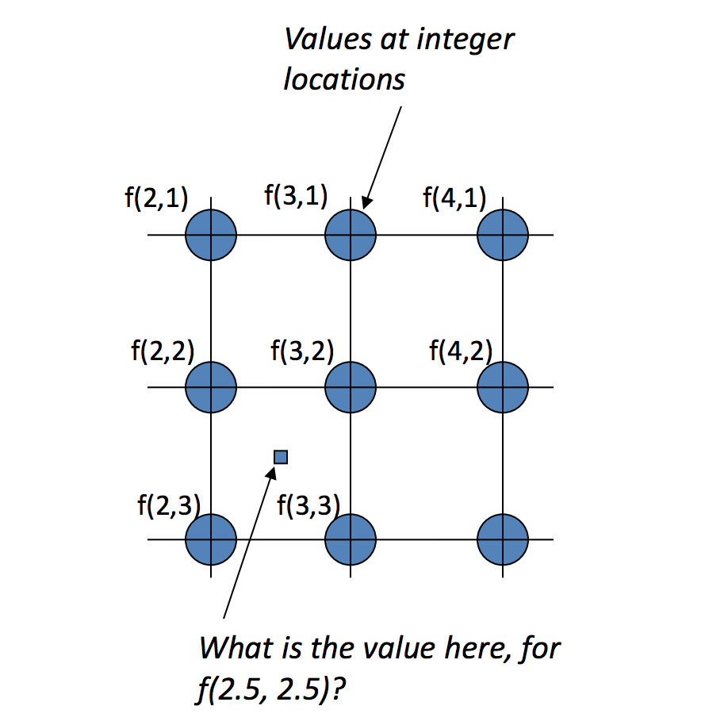

<h1> Living Room Redesign</h1>

<h6>Emily Quigley</h6>  

<h3>Premise:</h3> Part of my hobby, flipping houses, is to tear out an outdated room and build it back from scratch. Design becomes really important because having a well designed home will increase your profits when you sell. It can be really time consuming to develop the new design with fresh colors and materials and also hard to envision when you are staring at a room torn down to the studs.

<h3>My Question: What if there was machine learning for that? </h3>

  

<h3>Phase 1:</h3> Take a photo of an outdated living room and train a model to segment the sofa. This will later be used to replace with a new sofa which will provide the "redesign" element.
 
 

<h6> Data Set:</h6> ADE20K Living Room Images
This dataset came with an original image and a segmented image for each item in the room. Upon diving into the dataset I discovered that while the photos looked like each object was colored according to a specific code, they were not the same RGB values. I knew I was going to have to do a significant amount of cleaning on my data to make these images work.

<h3>Downsize:</h3> Working with images can be computationally expensive so for the purpose of this project I have chosen to focus solely on the sofa by making sofa pixels white and making all other pixels black.

<h3>Creating Labels</h3>

<h3>Complications</h3>
OpenCV can be a love, hate relationship. It's very technical to work with but also provides more advanced functionality.
 
 
Instead of RGB, OpenCV uses BGR so I discovered the hard way, if you are using OpenCV only use OpenCV for image processing.
Another complication is with resizing. I had used resize which was SKimage's resize instead of cv2.resize. I was trying to use some advanced function later on and was getting error messages mentioning CV_8U. I determined it wanted 8 bytes so I started checking the bytes in different stages and found out that after resizing I was getting a type float64. When I switched to cv.2 resize it solved this problem.
 
 
Later on I wanted to find the unique pixel colors and saw I was now getting 1105 unique pixel colors whereas previously I had gotten right around 35. I traced this back line by line to the resize function. I added the nearest neighbors interpolation method to solve this problem. Interpolation is a technique that helps handle distortion when resizing.

<h3>Solution</h3>
1. For each image, find the unique RGB values
2. Argsort and a mask to sort the RGB values from highest frequency to lowest
3. Make a mask for each unique RGB value in order to display an object.

