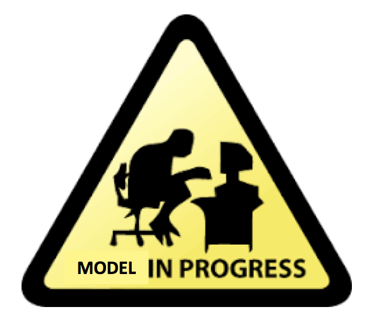

<h1> Living Room Redesign</h1>

<h6>Emily Quigley</h6>  

<h3>Premise:</h3> Part of my hobby, flipping houses, is to tear out an outdated room and build it back from scratch. Design becomes really important because having a well designed home will increase your profits when you sell. It can be really time consuming to develop the new design with fresh colors and materials and also hard to envision when you are staring at a room torn down to the studs.

<h3>
What if there was machine learning for that?
</h3>

<h3>Model 1:</h3> 

<h5>Purpose:</h5>Take a photo of an outdated living room and train a model to segment the sofa. This will later be used to replace with a new sofa which will provide the "redesign" element.

<h5>Downsize:</h5> Working with images can be computationally expensive so for the purpose of this project I have chosen to focus solely on the sofa by making sofa pixels white and making all other pixels black.
 
 

  

 

Eventually the goal will be to segment all key objects in the image

  

  

<h3> Data Set:</h3> ADE20K Living Room Images
This dataset came with an original image and a segmented image for each item in the room. Upon diving into the dataset I discovered that while the photos looked like each object was colored according to a specific code, they were not the same RGB values. I knew I was going to have to do a significant amount of cleaning on my data to make these images work.

<h3>Creating Targets</h3>
To create my target images I wrote my code to identify all of the unique color values from my segmented images. I took the unqiue colors values and looped through each object creating a mask and asking the user for input if the object was a couch or not. To help this go by faster, I found the frequency of each color value and sorted my list to start with the highest frequency colors first with the rationale being that the sofa will be one of the largest objects in the room and therefore towards the top of the list. I did this for approximately 700 images and saved the sofa as black and white as shown earlier.

  

  

  

<h3>Complications:</h3>
<h5> If you are using OpenCV, only use OpenCV</h5>
OpenCV is more technical to work with than other python image libraries but also provides more advanced functionality.
 
 
Instead of RGB, OpenCV uses BGR so the color values are reversed. 
 
 
Another complication is with resizing. I had used resize which was skimage's resize instead of cv2.resize. I was trying to use some advanced function later on in my code and was getting error messages mentioning CV_8U. I found out it wanted 8 bits/pixel so I started checking the data type in different stages and found out that after resizing I was getting a data type float64. When I switched to cv.2 resize it solved this problem. Going forward I now know that 8 bits/pixel is standard and it's what you want to use when saving or displaying an image and the float data types can be beneficial when you need to perform calculations since the values are between 0 and 1.
 
 
Later on I wanted to find the unique pixel colors and saw I was now getting 1105 unique pixel colors whereas previously I had gotten right around 35. I traced this back line by line to the resize function. When you resize an image, the space between the pixels gets approximated and this is what was inreasing my unique pixel colors to 1105. I added the nearest neighbors interpolation method to solve this problem. Instead of creating a new color value from averaging, the nearest neighbors uses the nearest already exisitng color.

  

<h3>Future Work</h3>

Implement autoencoder to segment
 
Srape the web for my redesigned images
 
Research generative portion for the second model
